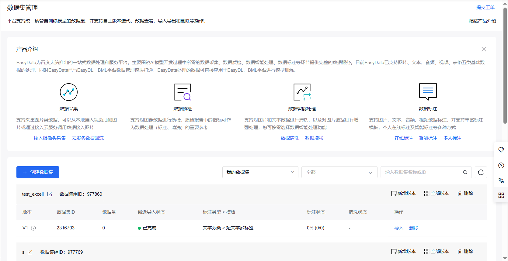
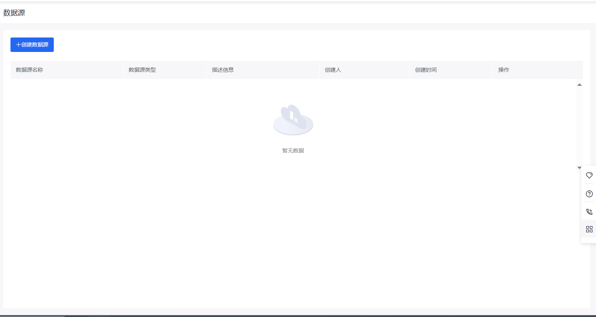
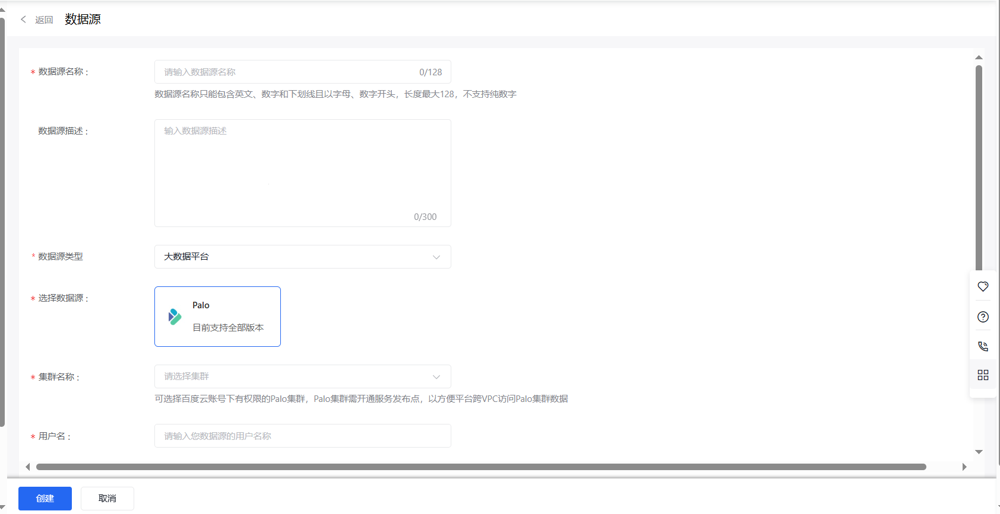
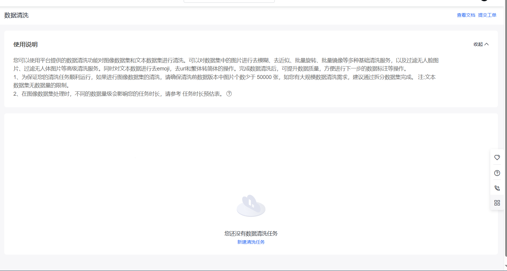
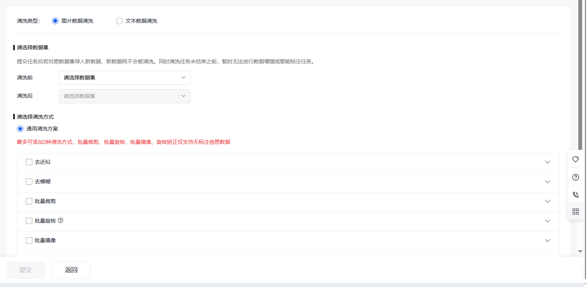
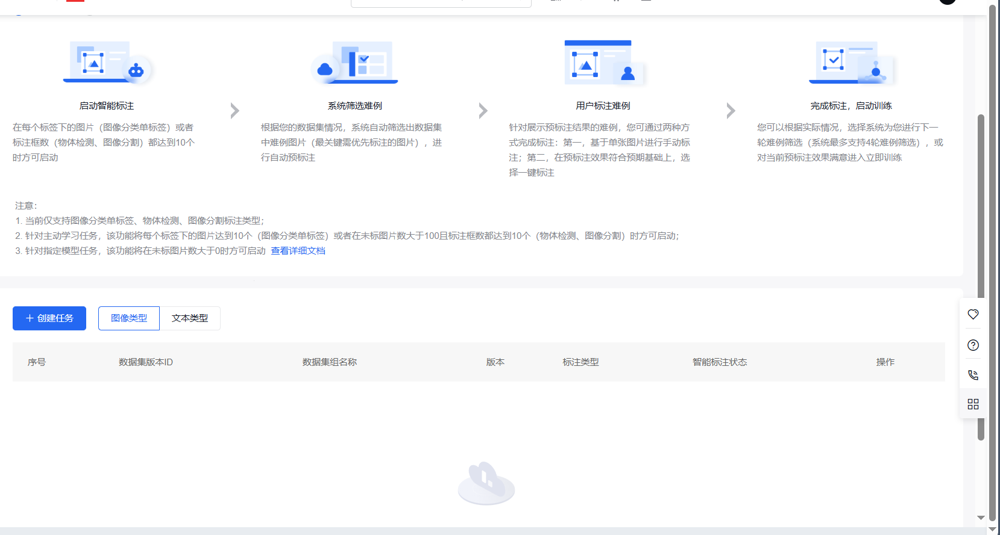
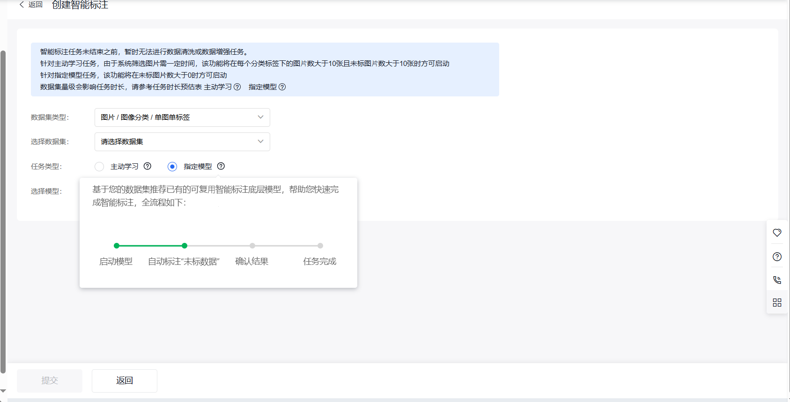

# 数据标注平台 UI 设计文档

## 1. 数据管理模块

### 1.1 数据集管理页面
#### 页面信息
- 路由路径: `/datasets`
- 页面标题: 数据集管理
- 主要功能: 数据集的CRUD操作、数据导入、数据集预览

#### 效果图
数据集管理，使用现有系统也行

#### 布局要求
1. 顶部操作区
   - 新建数据集按钮
   - 导入数据按钮
   - 视图切换按钮（列表/卡片）
   - 搜索框

2. 主要内容区
   - 数据集列表/卡片展示
   - 分页控件
   - 空状态展示

3. 右侧操作区
   - 快速操作按钮
   - 数据集详情展示

#### 交互说明
1. 新建数据集
   - 点击触发创建流程
   - 分步表单交互
   - 表单验证规则

2. 数据集操作
   - 编辑功能
   - 删除确认
   - 批量操作

3. 搜索和筛选
   - 实时搜索
   - 条件筛选
   - 结果高亮

### 1.2 数据源管理页面
#### 页面信息
- 路由路径: `/datasources`
- 页面标题: 数据源管理
- 主要功能: 数据源配置、连接测试、权限管理

#### 效果图
数据源：

创建界面

#### 布局要求
[待补充]

## 2. 数据整理模块

### 2.1 数据清洗页面
#### 页面信息
- 路由路径: `/data-cleaning`
- 页面标题: 数据清洗
- 主要功能: 文本和图片数据的清洗操作

#### 效果图
主界面

新建清洗任务（分图片、文本）

#### 布局要求
1. 左侧工具栏
   - 清洗规则配置
   - 操作历史记录

2. 中间预览区
   - 数据预览
   - 实时效果展示

3. 右侧参数区
   - 参数配置
   - 执行控制

#### 交互说明
[待补充]

### 2.2 数据对齐页面
#### 页面信息
- 路由路径: `/data-alignment`
- 页面标题: 数据对齐
- 主要功能: 文本对齐、图文对齐、多语言对齐

#### 效果图
自己设计

#### 布局要求
[待补充]

## 3. 数据标注模块

### 3.1 标注任务页面
#### 页面信息
- 路由路径: `/tasks`
- 页面标题: 标注任务
- 主要功能: 任务管理、进度跟踪、质量控制

#### 效果图
标签组管理可以用现有系统

在线标注也可使用现有

#### 布局要求
1. 顶部操作区
   - 创建任务按钮
   - 任务筛选器
   - 进度统计

2. 任务列表区
   - 任务卡片/列表
   - 状态标识
   - 进度展示

3. 详情面板
   - 任务详情
   - 操作按钮
   - 相关统计

#### 交互说明
[待补充]

### 3.2 标注工作台
#### 页面信息
- 路由路径: `/workspace`
- 页面标题: 标注工作台
- 主要功能: 数据标注、AI辅助、结果预览

#### 效果图
ai标注
主页面（普通的任务管理）

创建任务界面

#### 布局要求
1. 顶部工具栏
   - 工具选择
   - 撤销/重做
   - 保存按钮

2. 左侧标签栏
   - 标签列表
   - 快捷键提示

3. 中间工作区
   - 数据展示
   - 标注操作区

4. 右侧属性栏
   - 属性设置
   - AI建议
   - 历史记录

#### 交互说明
[待补充]

## 4. 数据合成模块

### 4.1 数据生成页面
#### 页面信息
- 路由路径: `/data-generation`
- 页面标题: 数据生成
- 主要功能: 图像生成、文本生成、数据增强

#### 效果图
无

#### 布局要求
[待补充]

## 5. 公共组件

### 5.1 导航栏
- 布局结构
- 响应式设计
- 交互效果

### 5.2 操作反馈
- 加载状态
- 成功/失败提示
- 进度展示

### 5.3 表单组件
- 验证规则
- 错误提示
- 自动完成

## 6. 主题设计

### 6.1 颜色系统
- 主色调
- 功能色
- 状态色

### 6.2 布局系统
- 网格系统
- 间距规范
- 响应式断点

### 6.3 字体系统
- 字体家族
- 字号层级
- 行高规范

## 7. 交互规范

### 7.1 操作反馈
- 即时反馈
- 加载状态
- 错误处理

### 7.2 动画效果
- 过渡动画
- 加载动画
- 交互动画

### 7.3 响应式设计
- 断点设计
- 布局适配
- 内容响应

## 8. 注意事项

### 8.1 性能优化
- 懒加载策略
- 分页处理
- 缓存机制

### 8.2 兼容性
- 浏览器兼容
- 设备适配
- 分辨率适配

### 8.3 可访问性
- 键盘操作
- 屏幕阅读
- 无障碍设计 x